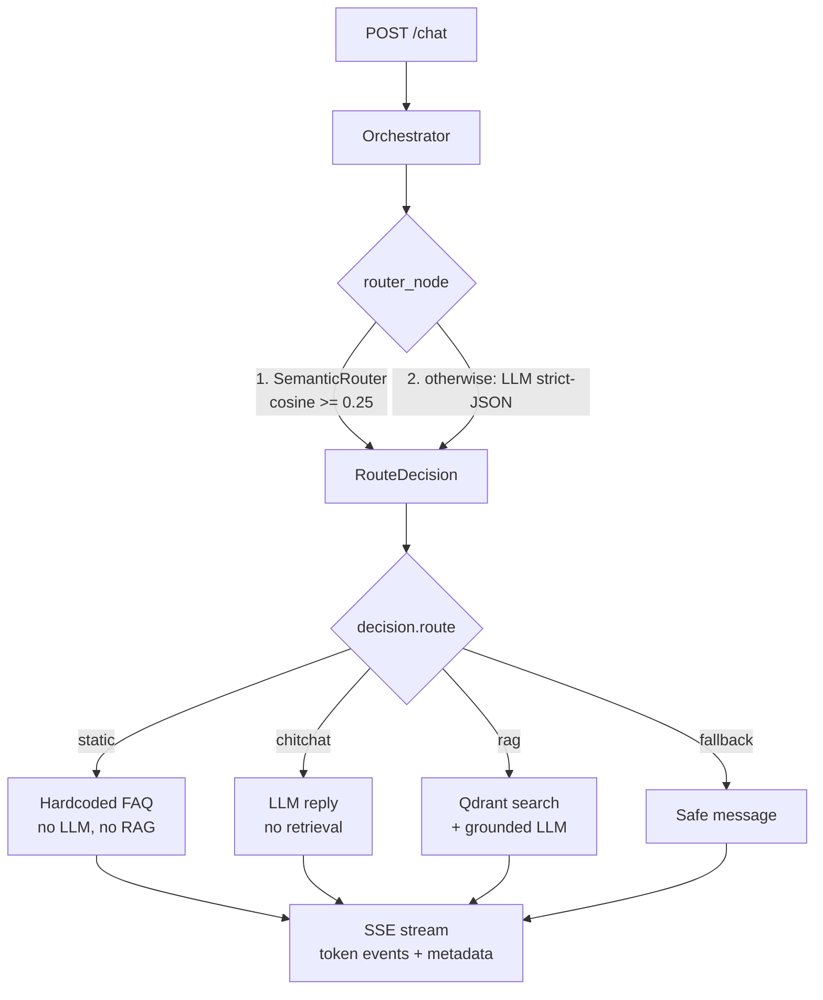
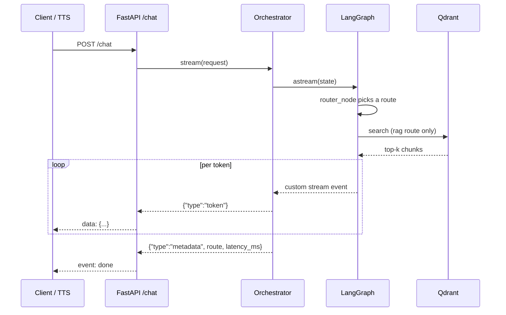

# Agentic Support Orchestrator

[](https://github.com/kamersaliha/ai-agent-orchestrator/actions/workflows/ci.yml)


Customer support routing backend built with LangGraph, FastAPI and Qdrant.

Most support messages don't need a large model. A cheap embedding router handles
those. The LLM classifier runs only when the fast router isn't confident. Answers
stream token by token over SSE, so a voice/TTS layer can start speaking before
generation finishes.

Runs offline by default: no API key, no network, no GPU needed.

**In short**

- Embeddings route first, the LLM runs only when they aren't sure (~45% of traffic never hits a model)
- Four paths: static FAQ · chitchat · RAG over Qdrant · safe fallback
- Token-by-token SSE streaming, ready to feed a TTS layer
- Swap mock → Claude → your own fine-tuned local model with one env var
- Dockerized with a real Qdrant, 17 offline tests

## How it works



Only the `chitchat` and `rag` paths call a language model. `static` and `fallback`
answer from fixed text, and the semantic router itself uses embeddings, not an LLM.

### Request lifecycle



| Route | When | How it answers |
|-------|------|----------------|
| static | Critical FAQs (launch date, pricing, hours, refunds) | Hardcoded answer, no LLM or RAG |
| chitchat | Greetings, small talk | Fast LLM reply, no retrieval |
| rag | Questions answerable from docs | Qdrant retrieval, then grounded LLM answer |
| fallback | Out of scope or unsafe | Fixed, safe message |

## Measured results

On the bundled corpus (97 unique messages from `scripts/prepare_dataset.py`):

| Metric | Result |
|---|---|
| Messages answered with no LLM call | ~45% |
| Routing accuracy on the fast path | ~98% |
| Nonsense inputs leaking through | 0/4 (they escalate, as intended) |

The threshold behind this is calibrated for the bundled offline embedder. See
[`app/core/config.py`](app/core/config.py). A test in
[`tests/test_router.py`](tests/test_router.py) keeps it from drifting.

## Quickstart

```bash
python -m venv .venv && source .venv/Scripts/activate   # Windows Git Bash
pip install -r requirements.txt

uvicorn app.main:app --reload
```

```bash
curl -N -X POST http://localhost:8000/chat \
  -H "Content-Type: application/json" \
  -d '{"message": "How do I reset my password?"}'
```

Token events stream in, then one metadata event at the end:

```
data: {"type": "token", "data": "Here's "}
data: {"type": "token", "data": "what "}
...
data: {"type": "metadata", "route": "rag", "intent": "documentation_lookup",
       "confidence": 0.3768, "source": "semantic", "entities": [],
       "latency_ms": 6.15, "retrieved": 3}
event: done
data: [DONE]
```

Token events are raw text, so they can feed a TTS stage directly. The metadata
event carries the routing decision and latency for analytics.

Other endpoints: `GET /health`, `GET /ready`, `GET /docs`.

## Docker

Starts the app and a real Qdrant server. No local Python needed.

```bash
docker compose up --build
# app:              http://localhost:8000
# Qdrant dashboard: http://localhost:6336/dashboard
```

The app connects to Qdrant at `http://qdrant:6333` on the compose network and waits
for it on startup. Vectors persist in a named volume. To use a local model, run
Ollama on the host and uncomment the `APP_LOCAL_*` block in `docker-compose.yml`.

## Fine-tuning the router

Routing is a narrow, repetitive task, so a small local model can do it instead of a
paid API call.

```bash
# 1. Build a balanced dataset (open-source data + synthetic), with a held-out eval split
python scripts/prepare_dataset.py --source mix --count 2000 \
       --balance --per-route 300 --eval-split 0.15 \
       --output data/generated/router.jsonl

# 2. Train on any CUDA GPU (or use the Colab notebook)
python scripts/finetune_router.py --data data/generated/router_train.jsonl --export-gguf

# 3. Serve it and point the app at it
ollama create support-router -f Modelfile
# .env:  APP_LLM_PROVIDER=local   APP_LOCAL_ROUTER_MODEL=support-router
```

The dataset script dedupes, splits per route, then balances only the training set,
so eval data never leaks into training. Real phrasing comes from the open-source
[Bitext support dataset](https://huggingface.co/datasets/bitext/Bitext-customer-support-llm-chatbot-training-dataset)
mapped onto the four routes here. Synthetic templates cover the rest.

- Notebook: [`notebooks/finetune_router_colab.ipynb`](notebooks/finetune_router_colab.ipynb).
  It measures route accuracy before and after training.
- Guide: [`docs/FINETUNING.md`](docs/FINETUNING.md) (in Turkish).

Providers sit behind one `LLMProvider` interface, so switching between mock, Claude
and a local fine-tuned model is a config change.

## Configuration

Copy `.env.example` to `.env`. All variables use the `APP_` prefix.

| Variable | Default | Purpose |
|----------|---------|---------|
| `APP_LLM_PROVIDER` | `mock` | `mock` (offline), `anthropic` (Claude), `local` (Ollama/vLLM) |
| `APP_ANTHROPIC_API_KEY` | – | Needed for the `anthropic` provider |
| `APP_LOCAL_ROUTER_MODEL` | – | Your fine-tuned router model tag |
| `APP_SEMANTIC_ROUTER_THRESHOLD` | `0.25` | Below this, escalate to the LLM classifier |
| `APP_QDRANT_LOCATION` | `:memory:` | Or a path, or a server URL (`http://qdrant:6333`) |
| `APP_RAG_TOP_K` / `APP_RAG_MIN_SCORE` | `3` / `0.18` | Retrieval depth and relevance floor |
| `APP_STREAM_TOKEN_DELAY_MS` | `12` | Per-token pacing for the mock generator |

## Tests and linting

```bash
pytest              # 17 tests, offline: router calibration, all four routes, SSE endpoint
ruff check .        # lint (rules configured in pyproject.toml)
ruff format .       # format
```

CI runs the test suite on every push and pull request.

## Notes on the design

- The cheap router runs first. The LLM only runs when it isn't confident. The
  threshold is the dial between cost and accuracy, and it was measured rather than
  guessed.
- Thresholds are calibrated to the bundled embedder. Its cosine scores sit on a much
  lower scale than real sentence embeddings, so a normal-looking value like 0.62
  would quietly turn the fast path off. If you swap the embedder, measure again.
- Offline defaults mean `git clone && pytest` works with no setup.
- `LLMProvider` and `Embedder` are `typing.Protocol`s, so swapping vendors needs no
  mocking framework in tests.
- Failures degrade instead of breaking: a classifier error or low confidence routes
  to the safe path, and a mid-stream error still emits the final metadata event.

## Project structure

```
app/
  api/          FastAPI routes (SSE /chat, health) and DI providers
  core/         config, logging, exceptions, token-stream helper
  graph/        LangGraph state, the 5 nodes, graph factory
  services/     embeddings, semantic router, LLM providers, Qdrant, knowledge base
  schemas/      RouteDecision and chat/event contracts
  orchestrator.py   runs the graph, emits token and metadata events
scripts/        dataset prep, Qdrant init, router fine-tuning
notebooks/      Colab fine-tuning notebook
tests/          router calibration, all four routes, HTTP/SSE
```

Layering rule: `api → orchestrator → graph → services → schemas/core`. Lower layers
never import higher ones.

## Limitations

This is a demo project. The semantic router and embedder are lightweight offline
stand-ins, so a real embedding model is needed for production use. There is no auth
or rate limiting on `/chat`, and no conversation memory across turns.

## License

[MIT](LICENSE)
